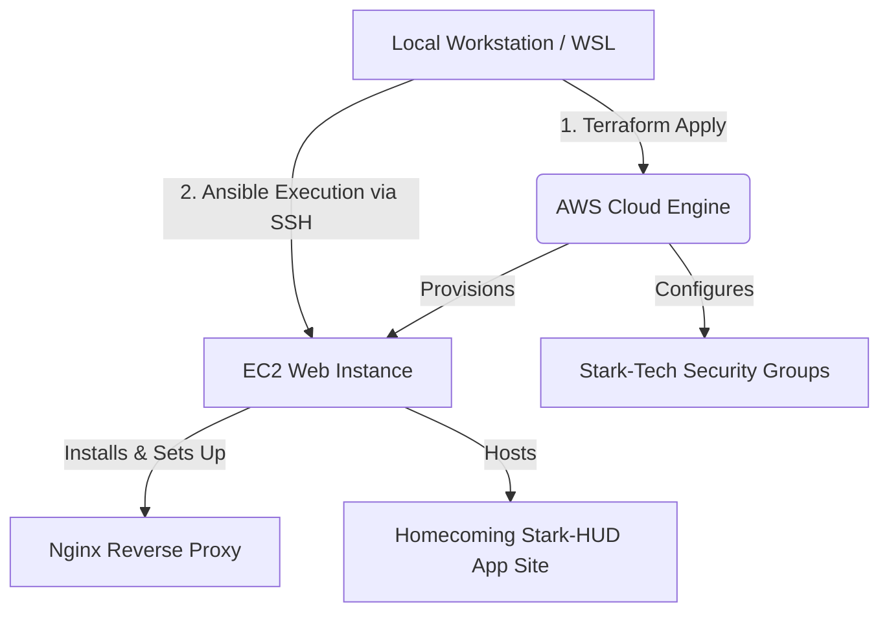

# 🕷️ SpideyDevOps: Stark-Tech Cloud Automation Protocol

[](https://www.terraform.io/)
[](https://www.ansible.com/)
[](https://aws.amazon.com/)
[](https://nginx.org/)

A high-tech DevOps automation engine that spins up secure AWS infrastructure via **Terraform (IaC)** and instantly activates **Ansible configuration protocols** to deploy an immersive, responsive *Spider-Man: Homecoming* Stark-HUD themed web application.

> 🌟 **"[ STATUS: ACTIVE // WITH GREAT POWER COMES GREAT AUTOMATION ]"**

---

## ⚡ System Architecture



---

## 🛠️ Stark-Tech Core Arsenal

| Component | Technology | Purpose |
| --- | --- | --- |
| **IaC Blueprint** | Terraform | Dynamic infrastructure provisioning & state lifecycle |
| **Config Manager** | Ansible | Zero-touch software orchestration & server stabilization |
| **Cloud Base** | AWS EC2 | High-performance Ubuntu cloud compute node |
| **Gatekeeper** | AWS Security Group | Firewall handling protocol isolation (SSH, HTTP) |
| **Web Core** | Nginx | High-efficiency static content delivery engine |

---

## 📁 Project Workspace Blueprint

```bash
terraform-ansible-project/
├── terraform/                  # Infrastructure Blueprint Files
│   ├── main.tf                 # Core AWS Resource Allocations
│   ├── variables.tf            # Operational Input Parameters
│   ├── outputs.tf              # Target Deployment Data Output
│   └── provider.tf             # Core AWS API Handshaking
├── ansible/                    # Configuration Engine Playbooks
│   ├── inventory.example       # Target IP Mapping Template
│   └── playbook.yml            # System Upgrade & App Deployment Directives
├── website/                    # Stark-HUD Web UI Bundle
│   ├── index.html              # Custom High-Tech Web Matrix
│   └── style.css               # Neon Cyan & Cyber Crimson Theme Engine
├── .gitignore                  # Keeps your AWS Credentials Classified
└── README.md                   # System Operations Manual

```

---

## 🔐 Firewall Protocol Architecture

Our Security Group acts as the ultimate threat firewall, strictly permitting only essential tactical ports:

* **Port `22` (SSH)** $\rightarrow$ Encrypted remote control interface for Ansible playbooks.
* **Port `80` (HTTP)** $\rightarrow$ Globally accessible clear-channel pipeline for the Stark-HUD application.

---

## 🚀 Deployment Protocols

### Phase 1: Environmental Handshake

1. **Clone the Combat Matrix:**
```bash
git clone <your-repo-url>
cd terraform-ansible-project

```


2. **Authenticate AWS CLI Credentials:**
```bash
aws configure

```


### Phase 2: Launching Infrastructure (Terraform)

Navigate into the engine room, initialize the state backend, verify your deployment profile, and apply changes:

```bash
cd terraform
terraform init
terraform plan -out=spidey.tfplan
terraform apply "spidey.tfplan"

```

> 📝 *Note down the generated **EC2 Public IP** from the console outputs.*

### Phase 3: Activating Configurations (Ansible)

1. Drop back into the workspace root and build your target inventory:
```bash
cd ../ansible
cp inventory.example inventory

```


2. Open `inventory` and bind your target node parameters:
```ini
[web]
<YOUR_EC2_PUBLIC_IP> ansible_user=ubuntu ansible_ssh_private_key_file=~/.ssh/your-key.pem

```


3. Initialize a structural health check ping:
```bash
ansible -i inventory web -m ping

```


4. Run the tactical setup orchestration matrix:
```bash
ansible-playbook -i inventory playbook.yml

```


---

## 🌐 Launch Web App

Once the configuration sequences successfully exit, target your browser to your live cloud matrix node:

```http
http://<YOUR_EC2_PUBLIC_IP>

```

---

## 🛸 Future Combat Upgrades

* [ ] **Dynamic Inventory Mapping:** Sync Ansible directly with AWS Ec2 tags so target lists populate automatically.
* [ ] **Edge Routing Overhaul:** Wire up Route53 hosting linked with automated Let's Encrypt SSL encryption.
* [ ] **Container Isolation Layer:** Move application structures to micro-Docker execution systems.
* [ ] **Stark-Tech CI/CD Pipeline:** Build GitHub Actions tracking files to run syntax checks and live builds dynamically.

---

## 🧹 Mission Cleanup Protocol

To dissolve all dynamic cloud instances instantly and completely avoid accidental billing overhead, run the clean cycle:

```bash
cd terraform
terraform destroy -auto-approve

```

---

## 👨‍💻 System Operations Lead

**Hritik Raj**
*DevOps & Cloud Systems Architect* 